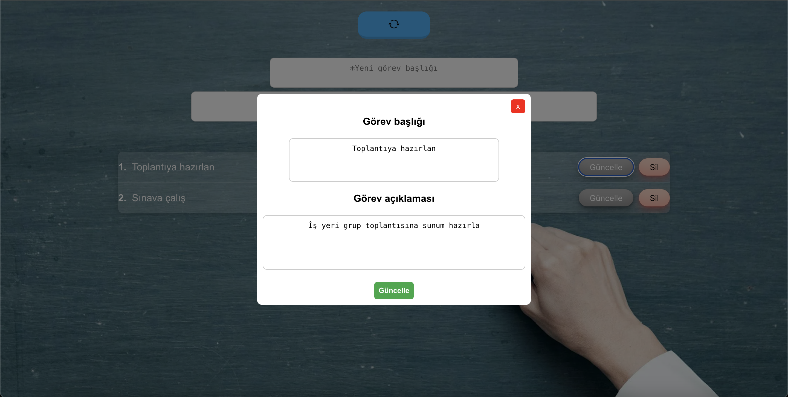

# Todo Application

This project is a **Todo Application** developed using React. The application allows users to create, edit, and delete tasks. It integrates with an API for dynamic data fetching and manipulation.

## Features

- **Add and View Todo Details**: Add tasks and view their details in a modal window.
- **Soft Delete, Hard Delete, and Undelete**: Temporarily delete, permanently remove, or restore tasks.
- **API Integration with Asynchronous Functions**: The application communicates with a backend API to perform the following CRUD operations asynchronously:
  - Fetch data (GET)
  - Add new data (INSERT)
  - Update existing data (UPDATE)
  - Delete data (DELETE)
- **Responsive Design**: Optimized for both mobile and desktop devices.
- **Enhanced UI with CSS**: User-friendly design with improved visuals.

## Requirements

- **Backend API**: A backend API is required for the application to function, supporting the CRUD operations mentioned above.
- **Node.js**: Required to run the React application.
- **Browser**: Compatible with modern browsers.

## Installation

Follow these steps to set up the project:

1. **Clone the repository**  
   Clone the project to your local machine:
   ```bash
   git clone https://github.com/kagankocman/todoappjs.git
   ```

2. **Navigate to the project directory**  
   Change your working directory to the cloned project:
   ```bash
   cd todoappjs
   ```

3. **Install dependencies**  
   Install the required packages:
   ```bash
   npm install
   ```


4. **Create a `.env` file**  
   - In the root directory of the project, create a file named `.env`.
   - Add the following line to the file, replacing `your_base_url_here` with the base URL of your API backend:
     ```bash
     REACT_APP_BASE_URL="your_base_url_here"
     ```

5. **Start the application**  
   Run the following command to start the development server:
   ```bash
   npm start
   ```

Your application should now be up and running at `http://localhost:3000`. Open your browser and explore the features!

## Usage
- After starting the application, connect it to a backend API for data exchange.
- Use the dynamic table to add, edit, or delete tasks.
- Navigate through data easily using the pagination feature.

## Contributing
Contributions are welcome! Please fork the repository and submit a pull request with your changes.

## Screenshots



